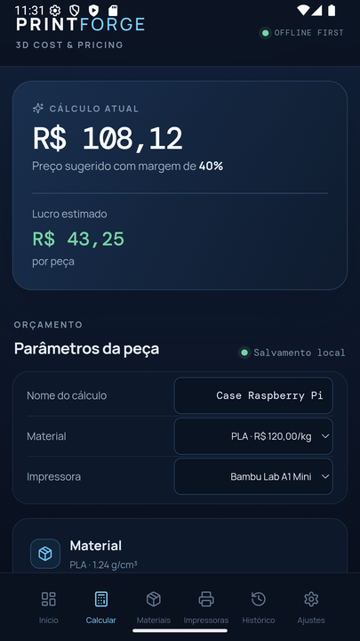
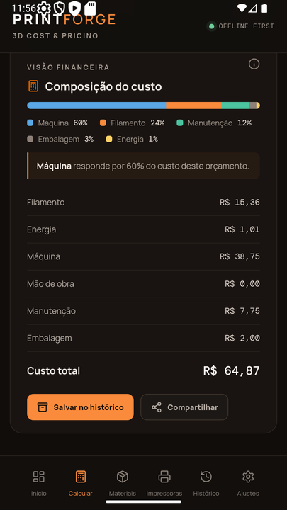
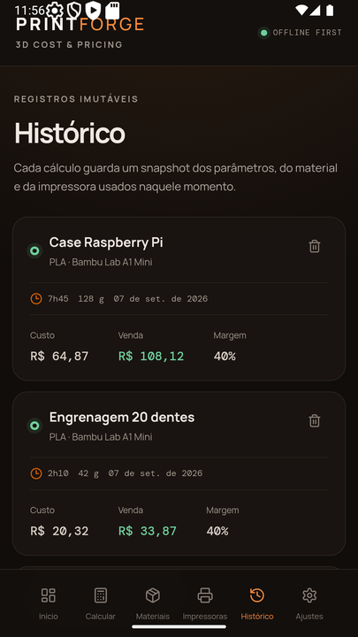
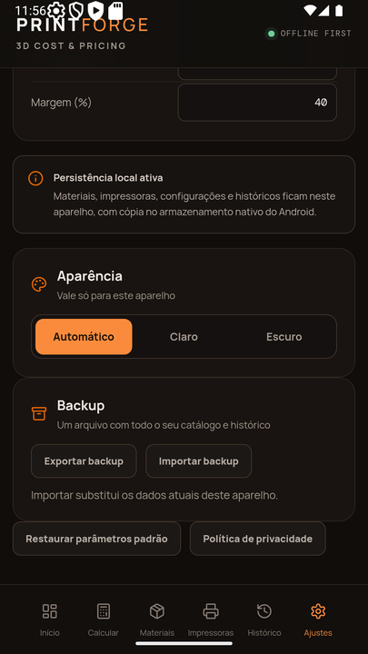

# PrintForge Mobile

Aplicativo web/Android offline-first para calcular custos e preços de impressão 3D. O PrintForge usa um núcleo financeiro determinístico, catálogo local de materiais e impressoras e histórico com snapshots completos.

## Telas

| | |
|---|---|
|  |  |
| **Cálculo** — preço e lucro no topo, parâmetros abaixo. | **Composição** — de que o custo é feito, e o que mais pesa. |
|  |  |
| **Histórico** — cada registro guarda um snapshot do que foi orçado. | **Ajustes** — parâmetros padrão, tema e backup. |

Capturas de emulador Android API 36, com o APK de release. As imagens em tamanho de loja ficam em `store-assets/`, fora do controle de versão.

## Estado atual

| Área | Implementação |
|---|---|
| Núcleo financeiro | `bigint` em centavos, arredondamento determinístico, margem sobre preço de venda |
| Entrada | Peso em gramas ou volume em cm³, convertido pela densidade do material |
| Navegação | Botão voltar do Android e voltar do navegador, pela mesma decisão pura |
| Resiliência | `ErrorBoundary` na raiz; falha de gravação é reportada, não engolida |
| Persistência | `localStorage` com validação de schema, espelhado em `SharedPreferences` no Android |
| Histórico | Teto de 500 registros, cada um com snapshot completo do que foi orçado |
| Estoque | Bobinas com saldo, baixa explícita a partir do histórico e correção por balança |
| Backup | Exportar e importar JSON, versão 2, com validação e mensagem própria por tipo de recusa |
| Aparência | Paleta ancorada no ícone — carvão quente e laranja — em tokens por papel, tema claro e escuro |
| Barra de status | Aparência declarada em `values/` e `values-night/`, e reaplicada pelo tema escolhido |
| Análise | Barra de composição do custo, destacando a fatia dominante |
| Nativo | 6 plugins Capacitor: app, preferences, filesystem, share, splash-screen, status-bar |
| Testes | 188 no total, 43 montando componentes com Testing Library |
| Verificação | APK de release percorrido em emulador Android API 36 |

## Paleta

A âncora é o ícone do aplicativo: laranja `#e06504` sobre carvão e branco. O app deriva dele, em vez de seguir uma paleta própria.

| | Escuro | Claro |
|---|---|---|
| Fundo | `#100d0b` | `#f7f4f1` |
| Acento | `#fb8b3c` | `#a8480a` |
| Texto sobre o acento | `#120c06` | `#ffffff` |

O laranja cru do ícone não vira acento diretamente: ele rende 5,58:1 sobre o fundo escuro — passa, mas no limite, e acento também é cor de texto — e apenas 3,10:1 sobre branco, o que reprovaria. Então clareia no escuro e escurece no claro.

Os neutros são carvão com viés quente, e não cinza puro como o do ícone: cinza neutro ao lado de um laranja forte lê como cor que ninguém escolheu.

Todo par texto/superfície foi medido antes de virar CSS — nenhum fica abaixo de 4,5:1, e os tons de apoio não descem de 3:1. O vermelho de erro foi empurrado para o carmim porque, vizinho de laranja, um vermelho alaranjado deixa de comunicar erro. As seis fatias da barra de custo têm escala própria, com o par mais próximo em ΔE 30 no escuro e 28 no claro.

## Estoque

Orçar não é imprimir. Um orçamento pode nunca virar peça, e a mesma peça pode ser impressa dez vezes — por isso salvar no histórico **não** mexe no estoque. A baixa vem de um toque explícito em "dar baixa" no registro do histórico, e pode ser repetida a cada reimpressão.

O saldo de uma bobina é sempre `baselineGrams` mais os movimentos dela; não existe um campo de saldo que possa divergir do extrato. Quando o extrato passa do teto, os movimentos mais antigos são dobrados no `baselineGrams` antes de sair — cortar a cauda como o histórico faz devolveria filamento já gasto, porque são as saídas que descontam.

Uma baixa maior que o saldo é recusada com a falta em gramas, em vez de deixar o número negativo. Para o caso em que a estimativa do fatiador divergiu do real, existe a correção por balança, que registra a diferença como movimento em vez de sobrescrever o saldo.

## Arquitetura

```text
src/
├── core/            # puro, sem React
│   ├── pricing.ts       # fórmulas em bigint
│   ├── money.ts         # centavos e formatação
│   ├── input.ts         # máscaras decimal e inteira
│   ├── volume.ts        # conversão volume ⇄ massa
│   ├── composition.ts   # repartição do custo
│   ├── stock.ts         # saldo de bobina e compactação do extrato
│   ├── navigation.ts    # decisão do botão voltar
│   ├── history.ts       # teto do histórico
│   ├── theme.ts         # resolução de tema
│   ├── format.ts        # duração e data
│   └── types.ts
├── application/     # casos de uso
│   ├── calculateQuote.ts
│   ├── backup.ts
│   ├── stock.ts
│   ├── saveMaterial.ts
│   └── savePrinter.ts
├── infrastructure/
│   ├── storage/         # repositórios e espelho nativo
│   └── native/          # hooks de Capacitor e ajuste da barra de status
├── features/        # uma tela por arquivo
├── components/      # primitivas e campos
├── App.tsx
├── main.tsx
└── styles.css
```

A interface `StorageRepository<T>` mantém a persistência desacoplada do domínio. O `localStorage` segue como cópia de trabalho síncrona — os inicializadores de `useState` precisam de leitura imediata — e cada gravação é espelhada em `SharedPreferences`. No boot, `restoreMissing` repõe apenas as chaves que sumiram do WebView: o espelho é rede de segurança, nunca fonte da verdade.

## Dados persistidos

| Chave | Conteúdo |
|---|---|
| `printforge.settings` | Energia, mão de obra, embalagem e margem padrão |
| `printforge.materials` | Catálogo de materiais |
| `printforge.printers` | Catálogo de impressoras |
| `printforge.calculations` | Histórico, cada item com snapshot de input, material, impressora e resultado |
| `printforge.spools` | Bobinas: material, cor, marca, peso de fábrica e saldo de partida |
| `printforge.stockMovements` | Extrato de baixas e ajustes, cada saída ligada ao orçamento que a gerou |
| `printforge.theme` | Preferência de tema deste aparelho — fora do backup de propósito |

## Desenvolvimento web

```bash
npm ci
npm run dev
```

Validação local:

```bash
npm run check   # tsc -b --noEmit
npm run test    # vitest
npm run build   # tsc -b && vite build
```

> `npm run check` usa `tsc -b`, não `tsc --noEmit`. O `tsconfig.json` raiz é um arquivo-solução com project references, e `--noEmit` sozinho não verifica os projetos referenciados — reportaria sucesso sobre código quebrado.

## Android

A pasta `android/` já foi criada com Capacitor e sincronizada com a build web. Para abrir no Android Studio:

```bash
npm run android:open
```

Para sincronizar alterações futuras:

```bash
npm run android:sync
```

Para gerar um bundle de release, configure uma keystore própria no Android Studio e então execute:

```bash
npm run android:release
```

A assinatura final não deve usar uma chave descartável. O arquivo `.aab` deve ser gerado e protegido no ambiente de release do responsável pelo aplicativo.

## Verificação em aparelho

O APK de release — o mesmo artefato que vai à loja, não uma build de depuração — foi instalado em emulador Android API 36 e percorrido item a item.

| Verificado | Resultado |
|---|---|
| Botão voltar | Fecha o formulário, volta uma aba, volta ao início e só então encerra |
| Exportar backup | Folha nativa de compartilhamento, com o arquivo nomeado por data |
| Importar backup | Seletor do sistema, parâmetros e catálogo substituídos |
| Persistência | Dados e preferência de tema sobrevivem a encerrar e reabrir |
| Abertura | Sem quadro branco entre o lançador e a primeira tela |
| Campos de tempo | Vírgula digitada não zera o valor |
| Temas | Claro e escuro legíveis, com a barra de status acompanhando |

Três defeitos apareceram nessa primeira sessão e foram corrigidos: ícones brancos da barra de status sobre o tema claro, preço de referência exibido cem vezes maior, e percentuais da composição que podiam somar 101%. Nenhum deles era visível em jsdom.

**Sem verificação ainda:** aparelho físico (variação entre fabricantes, memória apertada, toque real), rotação de tela, e o desenho do teclado numérico — o emulador não exibiu o teclado do sistema de forma confiável, então o layout depende apenas do `inputMode` declarado no código.

## Checklist de publicação

Antes do envio à Google Play, ainda devem ser preenchidos os dados da conta de desenvolvedor, verificação de e-mail e telefone, ficha do app, classificação etária, Data Safety, contato real da política de privacidade e assinatura segura do AAB.

A política de privacidade é servida em `/privacy.html` a partir da versão web, e o mesmo texto aparece dentro do app. As capturas de tela para a ficha estão em `store-assets/` — telefone em 1080×1920, tablets de 7" e 10" — fora do controle de versão por conterem material de loja.
